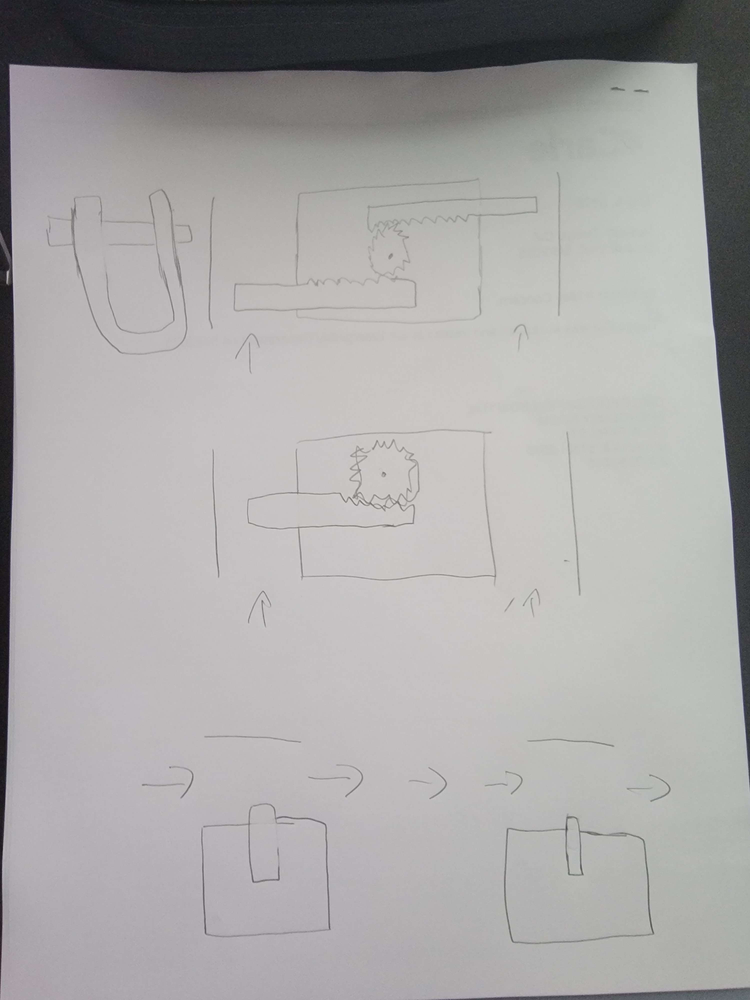
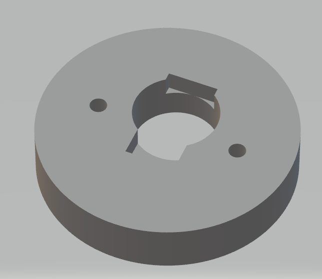

# Bowen Worklog

# Table of content
- [2025-01-31 - first meeting with group mates](#id1)
- [2025-02-04 - finishing up the RFA](#id2)
- [2025-02-10 - first TA meeting](#id3)
- [2025-02-25 - first Weekly TA meeting](#id4)
- [2025-03-04 - weekly TA meeting](#id5)
- [2025-03-09 - working on the breadboard demo](#id6)
- [2025-03-10 - breadboard demo](#id7)
- [2025-03-11 - ece machine shop meeting](#id8)
- [2025-03-25 - TA meeting after break](#id9)
- [2025-03-25 - Trying out ESP programming with old PCB](#id10)
- [2025-04-01 - First full PCB assembly](#id11)
- [2025-04-13 - final pcb manufacturing](#id12)
- [2025-04-22 - unipolar servo and bluetooth](#id13)
- [2025-04-23 - weekly TA meeting/unipolar servo](#id14)

# 2025-01-31 - first meeting with group mates
Objective: discuss and flesh out the bike lock project
First meeting with group mates, we discussed ideas for the bike lock project, we ended up settling first making a minimal viable product and not being too overly ambitious. We are going to make a bike lock with a digital app of some kind that can operate the lock remotely and access a log of events.

# 2025-02-04 - finishing up the RFA
Objective: finish up the RFA and submit
our initial RFA had some things that the professor and TAs wanted us to fix, we expanded the project significantly with the inclusion of a GSM/GPRS module that would allow us to send text messages and remain connected even when there is no wifi available nearby.  

# 2025-02-10 - first TA meeting
Objective: meet with the TA and discuss the proposal documentation
We met with our TA today regarding our proposal documentation, she clarified some questions that we had and explained some of the requirements. she clarified a contradiction between the rubric and the R&V document about whether or the subsystem requirements should be qualitative or quantative. 

# 2025-02-25 - first Weekly TA meeting

Objective: meet with the TA and discuss the up coming due dates

We met with our TA today and we discussed the pcb design and what we are expected to demonstrate during the breadboard demo. We discussed that since we would not have our finished pcb we would be expected to use breakout boards to demo our design in action. we also discussed that we needed to finish the pcb design by the weekend and start ordering for parts as soon as possible.

# 2025-03-04 - weekly TA meeting
Objective: meet with TA and discuss the breadboard demo
we met with our TA for the second weekly meeting and we discussed some of the design within our project and how we might do the breadboard demo when we dont have the acutal pcb and with our design evolving over time. we decided that we should mostly demo the software portions of our project with the 

# 2025-03-09 - working on the breadboard demo 
Objective: finish the breadboard demo
We worked on the breadboard demo, I primarily worked on the bluetooth connectivity where we use a serial bluetooth terminal on my phone to be able to remotely lock/unlock the prototype by actuating a motor. We also talked about different locking mechanisms for our final lock, I designed three different mechanisms where either the u-bar detaches or we could have the straight piece detach. The very first design was the bottom one, where some sort of linear actuator pushes a pin out to engage with the straight bar, however we quickly decided we wanted to use a motor to actuate the lock, Therefore i came up with the two designs above where we could either have one or two pins be actuated using a rack and pinion gear system with a cam that would turn rotational torque from the motor in to linear motion in pins, engaging with the u-bar lock and holding it in the locked position.

# 2025-03-10 - breadboard demo 
Objective: breadboard demo
We met with our TA and the professor to show off our prototype demo. we demonstrated the wifi connectivity where we were able to capture and read the data of the IMU over a wifi connection. we also demonstrated the ability to control the locking and unlocking through bluetooth. 

# 2025-03-11 - ece machine shop meeting 
Objective: meet with the eshop to discuss them manufacturing a lock for us
We met with the ece machine shop to discuss the feasibility of them manufacturing the lock for us, During the conversation, they suggested that instead of a u bar lock that we initially wanted, it would be much easier to manufacture a cable lock. We eventually decided to go with the cable lock design.

# 2025-03-25 - ta meeting after break
Objective: weekly TA meeting 
we met with our TA for our weekly meeting, we talked about checking out components and integrating a USBC port in the pcb design with the ESP32 and what traces we would need and whether or not we should use USBC or micro USB.  

# 2025-03-25 - Trying out ESP programming with old PCB
Objective: to fully assemble the ESP programming circuit of the V3 PCB to test it
We met in the ece lab room and we soldered the components to the pcb, There were quite a few problems, for example the first two tries of the ESP23 resulted in bridged connections under the ESP32 with neighboring pins being bridged. I managed to de-solder the ESP32 and try again using the oven to "unbake the solder". I ended up having to use a pair of tweezers to manually seperate the beads of soldering paste so that there are no contact and then bake the pcb for slightly longer so the solder would not bridge.

# 2025-04-01 - First full PCB assembly]
Objective: to fully assemble the entire V3 PCB 
We met in the soldering lab again to fully assemble every component of the V3 pcb, This would allow us to test not only the programming circuit itself, but to test it with the othe components of our design, being the buzzers, the accelerometer and the motor. We did not have a stencil for this board specifically therefore I ended up hand soldering every other component besides the esp32. Hand soldering was fine except that it was sometimes very difficult to get the solder to stick to each other, which is partially because of us not having flux. What was especially difficult was the solder bridge that i needed to make where the only way to get it to stick was to build a mound of solder in each of the holes and then slowly add more solder without melting the rest of the mound.

# 2025-04-13 - final pcb manufacturing]
Objective: to fully assemble a working V4 PCB
This was when our final PCB was delivered and we could assemble a completed product, the V4 pcb was much cleaner in terms of traces, we also cleaned up some left over components that arent needed, we also significantly reduced the size of the board, Which allowed us to fit it inside our housing. The V4 pcb also was the first pcb where I attempted to bake pretty much every connection. It took two tries to get the solder paste applied good enough to my standards, but the bake worked out pretty well, I used a multimeter to verify all of the connections and everything looked to be in order. There were a few components that I ended up having to manually do, such as the solder bridge and a power regulator where half of a pin was broken off, so I had to bridge it with solder, but We were able to successfully verify that the board would program and run the servo.

# 2025-04-22 - unipolar servo and bluetooth]
Objective: finish final assembly of the lock and test every subsystem in the lock
We planned on finishing the final assembly of the lock today with all the mechanisms inside the lock. We have tested the different components outside the lock but never inside. the assembly was fine and we were able to build the lock with all the components, we were also able to update our bluetooth code to use BLE 5.0 instead of the older bluetooth serial protocol we were using before. The main problem we encountered was that we did not realize that our motor was unipolar instead of bipolar, and our lock relies on the motor being able to turn the shackle both ways. We discussed what would be the better solution between switching to a bipolar motor or using a servo and decided to discuss with the TA tomorrow

# 2025-04-23 - weekly TA meeting/unipolar servo
This was one of our weekly TA sessions, We discussed about the mock demo and how we should prepare for the actual demo and presentation, we discussed whether we should switch to a bipolar motor or if we should just use a servo, we ended up deciding on a servo and over the next day or two I managed to design a 3d printed bracket that we could use to mount the servo while my groupmates were going to ask the ECE eshop whether or not they could help with altering the lock to fit the servo. The Eshop ended up resizing the lock so the bracket went unused.

